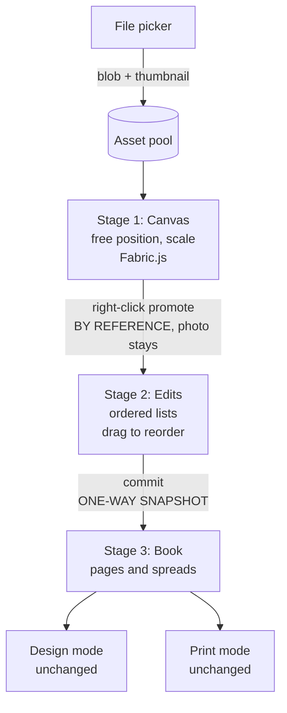
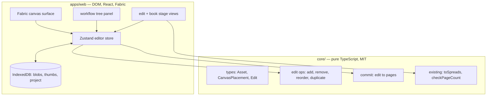
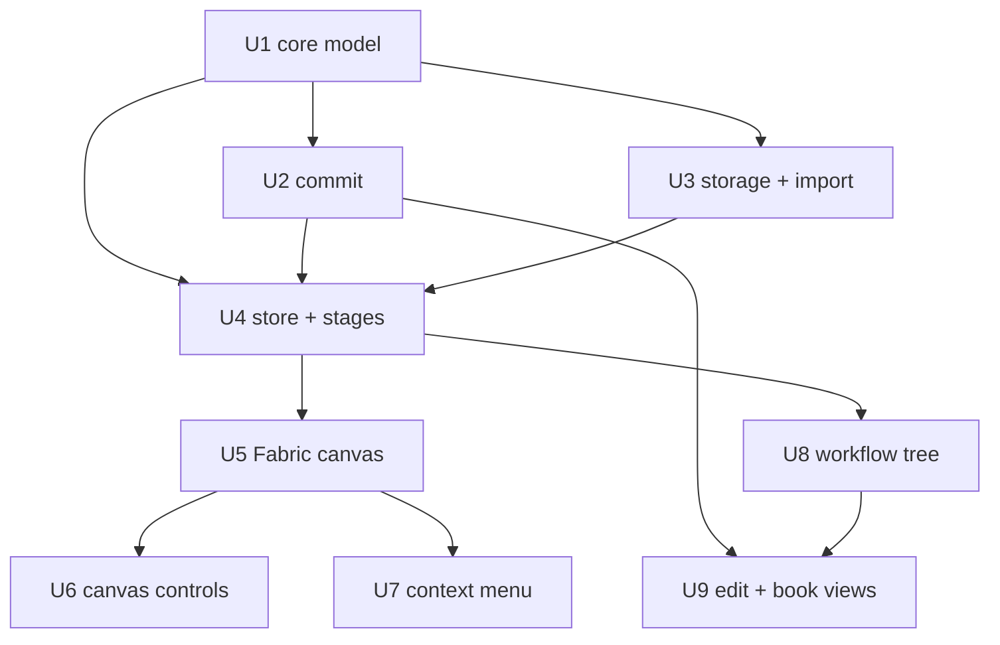

# Sequence Light Table - Plan

## Goal Capsule

**Objective.** Turn Sequence mode into a three-stage funnel — a free Fabric.js canvas, named Edits, and the committed Book — backed by real image import and local persistence.

**Authority hierarchy.** This plan, then `CLAUDE.md`, then `docs/plans/00-initial-build-brief.md`. Where this plan contradicts the brief, this plan wins and the contradiction is named in Key Technical Decisions.

**Execution profile.** Nine units, dependency-ordered. Units 1-2 are pure TypeScript in `core/` and can land before any UI work. Unit 3 (storage) and Unit 5 (Fabric) are the two highest-risk units; both are independently verifiable before the stage views depend on them.

**Stop conditions.** Stop and surface rather than guessing if: the Fabric v7 canvas cannot be made to resize correctly inside the collapsing grid columns; thumbnail generation blocks the main thread badly enough to break dragging at ~50 images; or committing an edit would require `core/` to reach for a DOM API.

**Tail ownership.** `ce-work` owns implementation and local verification. Commit, push, and PR are a separate decision.

---

## Product Contract

### Summary

Sequence mode becomes a three-stage funnel navigated from a left-hand workflow tree: a free-flowing Fabric.js canvas holding every imported photo, named Edits that collect photos by reference into candidate sequences, and the Book — the existing spread grid, now the committed final stage. Real image import with IndexedDB persistence lands in the same pass, because placeholder rectangles cannot be sequenced.

### Problem Frame

The shipped Sequence mode is a static grid of derived spreads. It presents a book that already has an order, which is the wrong tool for the moment when a photographer does not yet have one. The observed workshop problem was the opposite situation: photographers spread prints across a table or floor, walk around them, and try pairings — and the friction of a page-based tool is exactly what breaks that. The product is named after the instrument used over a light table; the primary interaction should be the light table.

The current data model cannot express this. `pages[]` is the only home an image has, so there is no representation of a photo that has been imported but not yet placed. Nor is there any way to hold two competing orderings side by side, which is what iterating on a sequence actually means.

### Requirements

**Canvas stage**

- R1. Every imported photo appears on an infinite, pannable, zoomable canvas as a freely positioned object.
- R2. Photos can be moved and scaled on the canvas without any placement constraint, snapping, or page association.
- R3. Canvas arrangement is a first-class part of project state — position, scale, and rotation survive a reload.
- R4. The canvas resizes correctly when the left or right panel opens or closes, consistent with the existing collapsing-grid shell.

**Edits**

- R5. A user can create any number of named Edits, each an ordered list of photos.
- R6. Photos are added to an Edit by right-clicking them on the canvas and choosing a target Edit or creating a new one.
- R7. Adding a photo to an Edit does not remove it from the canvas, and the same photo may belong to multiple Edits at once.
- R8. Within an Edit, order is set by explicit drag-to-reorder — never inferred from canvas position.
- R9. An Edit can be duplicated, so a user can branch a variant from a working sequence.
- R22. An Edit can be renamed and deleted.

**Book and commit**

- R10. Committing an Edit writes its ordered photos into the book's pages as a one-way snapshot; afterward Edit and Book are independent.
- R11. Re-committing over an existing book warns before overwriting.
- R12. The Book stage renders the existing spread grid and surfaces the saddle-stitch page-count check.

**Import and persistence**

- R13. Photos are imported through a file picker and stored locally; no upload, no account, no network.
- R14. The canvas renders downscaled thumbnails, not full-resolution images.
- R15. Full-resolution originals are retained for later Design and export use.
- R16. Whole-project state — assets, canvas arrangement, edits, and pages — persists locally and restores on reload.

**Navigation and controls**

- R17. A left-hand tree shows Canvas, Edits, and Book as a navigable hierarchy and is the means of switching between the three stages.
- R18. A floating control cluster in the bottom-right of the canvas offers zoom in, zoom out, current zoom level, fit-to-view, and reset to 100%.
- R19. Zoom in, zoom out, and reset-to-100% each show a delayed hover tooltip naming their keyboard shortcut, rendered for the viewer's platform (`Ctrl` on Windows/Linux, `⌘` on macOS). Fit-to-view has no shortcut and its tooltip names only the action.
- R20. Zoom keyboard shortcuts act on the canvas, not on browser page zoom.
- R21. First run presents an empty canvas with an import affordance rather than a sample project.

### Scope Boundaries

- Design mode keeps its current plain-DOM spread rendering. Fabric.js is proven on the light table first.
- The context menu carries promotion and commit actions only. General canvas actions — duplicate, delete, bring-to-front, group — stay deferred per the build brief.
- Rotation is stored in the data model but no rotation handle ships in this pass.
- Canvas zoom shortcuts are guaranteed on Chromium and Firefox, best-effort on Safari. Safari handles `⌘` `+`/`-`/`0` at browser-chrome level and does not deliver a cancelable keydown, so KTD8's interception cannot suppress native page zoom there. U6 omits the shortcut line from the tooltip when interception does not take effect rather than advertising a shortcut that scales the interface.

#### Deferred to Follow-Up Work

- Fabric.js in Design view, replacing the DOM spread renderer.
- Multi-select and marquee selection on the canvas.
- Project export/import as a `.loupe` bundle (the brief's manual backup path).
- Auto-arrange or clustering assistance on the canvas.

---

## Planning Contract

### Key Technical Decisions

- KTD1. The grouping concept is named **Edits**. (session-settled: user-directed — chosen over Takes, Sections, and Sequences: "the edit" already means a selection-and-order in photobook practice, matching the audience's own vocabulary.)

- KTD2. Committing an Edit to the Book is a **one-way snapshot**. (session-settled: user-directed — chosen over live binding and reopenable round-trip: two simultaneously editable representations of the same ordering make "I moved a caption in Design, then dragged on the table" ambiguous.)

- KTD3. Canvas → Edit is **membership by reference, not a move**. A photo promoted into an Edit stays on the canvas and may belong to several Edits. (session-settled: user-directed — chosen over move semantics: competing edits are only comparable if the same photo can appear in all of them.)

- KTD4. Edit membership is **explicit**, set by the context menu; spatial containment does not imply membership. Order within an Edit is explicit drag-to-reorder. (session-settled: user-approved — chosen over deriving order from canvas geometry with row banding: row detection is irreducibly fuzzy on a free canvas, and structure should increase stage by stage rather than being reverse-engineered from stage one.)

- KTD5. Canvas placements are **center-anchored**. Fabric v7 changed `originX`/`originY` to default to `'center'`; storing top-left coordinates would mean converting on every read and write. Center anchoring also makes scale-in-place behave correctly without recomputing position.

- KTD6. Thumbnails are generated by **drawing to a canvas**, not by `createImageBitmap` resize options. Safari does not support `resizeWidth`/`resizeHeight`/`resizeQuality`; only Chromium implements them fully. The canvas path works everywhere and keeps one code path.

- KTD7. **Whole-project state persists**, not only image blobs. (session-settled: user-approved — chosen over persisting imported files alone: losing a canvas arrangement on refresh mid-sequence destroys exactly the work this feature exists to support.)

- KTD8. Loupe **intercepts `Ctrl`/`⌘` `+`, `-`, and `0`** and applies them to canvas zoom. (session-settled: user-approved — chosen over leaving native browser zoom: a tooltip advertising a shortcut that scales the entire interface instead of the photos would be actively wrong.)

- KTD9. First run starts **empty**. The twelve-page sample project is removed. (session-settled: user-approved — chosen over keeping the fixture: a sample book with no real pixels cannot demonstrate sequencing once import exists.)

- KTD10. Fabric.js is loaded by **dynamic import inside a client component**. It touches `document` at module scope and will break Next's server render otherwise. `core/` never imports it.

- KTD11. The context menu is built on **`@base-ui/react/menu`**, already present via the shadcn preset. No new menu dependency. This narrowly reverses the build brief, which deferred canvas context menus entirely; the reversal covers promotion and commit actions only, and general canvas actions stay deferred. Fabric v7 defaults `fireRightClick` and `stopContextMenu` to `true`, so right-click arrives through the normal `mouse:down` event with `button === 3` — set both explicitly anyway rather than depending on a default, since U7's entire approach collapses if it changes.

- KTD12. Pointer coordinates use **`getScenePoint()` / `getViewportPoint()`**. Fabric v7 removed `getPointer()`, and removed `setWidth()`/`setHeight()` in favour of `setDimensions()` — which the panel-collapse resize path depends on. Most Fabric examples online predate this.

- KTD13. Edit members reference **asset ids, not placement ids**. An Edit is a statement about which photographs are in a sequence, and it should survive the photo being moved, rescaled, or removed from the canvas. Referencing placements would couple a candidate sequence to canvas bookkeeping and break the edit whenever the canvas changed. The cost is that one asset cannot appear twice in a single edit — acceptable for a photobook, where a repeated plate is rare and would be better expressed as a second asset.

- KTD14. The app **requests persistent storage** via `navigator.storage.persist()` on first import. IndexedDB is evicted by a least-recently-used policy when the device fills up, and persistent storage is skipped during automatic eviction. For a local-first tool with no account and no cloud copy, eviction is silent total data loss, so this is the only defence available until project export ships.

### High-Level Technical Design

The three stages form a funnel where structure increases and freedom decreases at each step. The two transitions have deliberately different semantics.



Layer boundaries hold the licensing split. Everything that is arithmetic lives in `core/`; everything that touches the DOM lives in `apps/web/`.



Unit dependency order:



### Assumptions

- A working session is on the order of tens to low hundreds of photos, not thousands. Thumbnail-only rendering is sized for that; virtualization is not planned.
- Imported files are ordinary web-decodable stills (JPEG, PNG, WebP). RAW and TIFF are out of scope for this pass.

### Implementation Constraints

- `core/` must remain free of React, Next, Fabric, Stripe, and DOM globals. The existing grep check in the Verification Contract enforces this.
- The app stays desktop-only below 1024px.
- The shell architecture is fixed: panels are grid columns that collapse to zero width, and the top nav never moves between modes.
- `core/` currently has no test runner. Unit U1 adds Vitest to the `core` workspace; without it the test scenarios below cannot run.

**Testing approach.** The repo has no test infrastructure at all today, and this plan does not add a browser or component test stack — that is its own decision and its own workstream. Instead, coverage is two-tier, and the split is deliberate: any logic worth asserting on is pushed into `core/`, where Vitest runs and where the purity rule already forces it to be free of DOM entanglement. Geometry that would otherwise hide inside a React component — bounding boxes for fit-to-view, thumbnail target dimensions — therefore lives in `core/src/geometry.ts` rather than in the canvas code. What genuinely cannot be unit-tested without a DOM (Fabric interaction, context menus, tree navigation) is proven by the browser checks in the Verification Contract, and those units say so rather than implying automated coverage that does not exist.

---

## Implementation Units

### U1. Asset pool, canvas placements, and edits in core

**Goal.** Extend the data model so a photo can exist without belonging to a page, and so ordered candidate sequences can be expressed.

**Requirements.** R1, R2, R5, R7, R8, R9

**Dependencies.** None.

**Files.**
- `core/src/types.ts` — add `Asset`, `CanvasPlacement`, `Edit`; extend `Project` with `assets`, `canvas`, `edits`
- `core/src/edits.ts` — new: pure edit operations
- `core/src/collections.ts` — new: shared `moveItem` helper
- `core/src/geometry.ts` — new: `boundingBoxOf(placements, assets)`, `thumbnailTarget(width, height, maxEdge)`, `layoutNewPlacements(existing, newAssets, assets)`
- `core/src/sequence.ts` — refactor `movePage` to delegate to `moveItem`
- `core/src/fixtures.ts` — reduce to an empty-project factory
- `core/src/index.ts` — export the new modules
- `core/package.json`, `core/vitest.config.ts` — add Vitest to the workspace
- `core/src/edits.test.ts`, `core/src/collections.test.ts`, `core/src/geometry.test.ts` — tests

**Approach.** `Asset` carries metadata only — id, filename, natural dimensions, import timestamp — never pixel data; blobs live in IndexedDB and are addressed by asset id. `CanvasPlacement` carries `{ id, assetId, x, y, scale, rotation }` where `x`/`y` are the placement's **center** per KTD5. `Edit` carries `{ id, name, memberIds, createdAt }` where `memberIds` is an ordered list of asset ids — referencing assets rather than placements, so an Edit survives the photo being moved on the canvas.

Edit operations are pure and total: `createEdit`, `addToEdit` (append, no-op if already a member, satisfying R7's multi-membership without duplicates inside one edit), `removeFromEdit`, `reorderEditMember`, `duplicateEdit` (new id, name suffixed, members copied). Extract the array-move logic currently inside `movePage` into `moveItem` and have both `movePage` and `reorderEditMember` use it rather than writing the splice twice.

A placement stores no dimensions of its own, so `boundingBoxOf` takes the asset pool alongside the placements and resolves each one's extent from its asset's natural dimensions times `scale`. Without the pool it could only treat placements as points, and fit-to-view would clip every photo at the edge of the arrangement.

`layoutNewPlacements` decides where imported photos land, which is otherwise unspecified and would leave the implementer inventing it. It lays new assets out in a left-to-right, top-to-bottom grid positioned below the existing arrangement's bounding box, so a second import does not bury the first. One scene unit is one pixel of the **original** image, and `scale: 1` means the photograph at its natural size — fixing that definition here is what makes `boundingBoxOf`, fit-to-view, and later export-resolution math agree on what a placement's size means. The canvas scales the thumbnail up to that natural size on draw, so the thumbnail is a rendering detail rather than a coordinate system. A consequence: 100% zoom shows a large photograph larger than the viewport, so the canvas frames the arrangement on first load rather than opening at 1:1.

**Patterns to follow.** The existing `core/src/sequence.ts` shape — exported pure functions over readonly arrays returning new arrays, no mutation, no classes. Keep the `noUncheckedIndexedAccess` discipline already enabled in `core/tsconfig.json`.

Add a `test` script to `core/package.json` — the Verification Contract calls `npm test --workspace=@loupe/core` and the workspace has no such script today. Import `describe`/`it`/`expect` explicitly from `vitest` rather than enabling globals, so the new `*.test.ts` files typecheck under the existing `include: ["src/**/*.ts"]` without adding a `types` entry.

**Test scenarios.**
- `moveItem` moves an element forward and backward, and clamps a target index beyond either end rather than throwing.
- `moveItem` on an out-of-range source index returns the array unchanged.
- `addToEdit` appends an asset id and preserves existing order.
- `addToEdit` with an id already present returns an equivalent edit without duplicating the member.
- The same asset id can be added to two different edits, and both retain it.
- `removeFromEdit` drops only the named member and preserves the order of the rest.
- `reorderEditMember` moves a member to a new index and leaves membership unchanged.
- `duplicateEdit` produces a new id, copies members in order, and mutating the copy's members does not affect the original.
- An empty project factory returns zero assets, zero placements, zero edits, and zero pages.
- `boundingBoxOf` over scattered center-anchored placements returns a box containing all of them, accounting for each placement's scaled half-extent rather than treating it as a point.
- `boundingBoxOf` over an empty list returns a degenerate box at the origin rather than infinities.
- `boundingBoxOf` skips a placement whose `assetId` is absent from the asset pool rather than throwing or contributing a zero-size box at the origin.
- `thumbnailTarget` scales a landscape image on width and a portrait image on height, preserving aspect ratio.
- `thumbnailTarget` on an image already smaller than the maximum edge returns the original dimensions rather than upscaling.
- `layoutNewPlacements` on an empty canvas lays the first import out in a grid starting at the origin, without overlaps.
- `layoutNewPlacements` with an existing arrangement positions the new grid clear of the existing bounding box.

**Verification.** `npm run typecheck` passes; the new Vitest suite runs green from the `core` workspace; the `core/` purity grep still returns nothing.

---

### U2. Commit an edit to the book

**Goal.** Turn an ordered Edit into the book's pages as a one-way snapshot.

**Requirements.** R10, R11, R12

**Dependencies.** U1.

**Files.**
- `core/src/commit.ts` — new
- `core/src/commit.test.ts` — tests
- `core/src/index.ts` — export

**Approach.** `commitEditToPages(edit, assets)` returns a fresh `Page[]`: one page per member in order, each carrying a single image element whose `assetId` is the member and whose `name` is the asset's filename. Frame geometry reuses the normalized-box convention already established in the current fixtures, so the Book stage and Design mode render committed pages without special-casing.

The function is pure and returns pages; it does not decide whether to overwrite. Overwrite is a UI concern — the store checks whether `pages` is non-empty and routes to a confirmation before calling. Pair the commit with the existing `checkPageCount` so the caller can surface the saddle-stitch result immediately (KTD2 means there is no later moment when the book and the edit reconcile).

**Patterns to follow.** `core/src/sequence.ts:checkPageCount` for the shape of a function that returns a structured result with a human-readable `message` rather than throwing.

**Test scenarios.**
- Committing a three-member edit produces three pages in the same order.
- Each produced page carries exactly one image element referencing the correct asset id.
- Committing an empty edit produces zero pages rather than throwing.
- An edit referencing an asset id absent from the asset pool is skipped rather than producing a page with a dangling reference.
- Committing the same edit twice produces equal page content but fresh page ids — the second commit does not alias the first result.
- Mutating the returned pages does not affect the source edit.
- `checkPageCount` over a committed twelve-member edit reports valid for saddle stitch; over a ten-member edit it reports two pages needed.

**Verification.** Vitest suite green; `npm run typecheck` passes.

---

### U3. Local storage and image import

**Goal.** Import photos from disk, store them locally, and generate the downscaled thumbnails the canvas renders.

**Requirements.** R13, R14, R15, R16

**Dependencies.** U1.

**Files.**
- `apps/web/lib/storage/db.ts` — new: IndexedDB schema and open logic
- `apps/web/lib/storage/assets.ts` — new: import, thumbnail generation, blob URL lifecycle
- `apps/web/lib/storage/project.ts` — new: project save/load
- `apps/web/package.json` — add `idb`

**Approach.** Three object stores behind `idb`: `originals` (full-resolution blob keyed by asset id, per R15), `thumbnails` (downscaled blob), and `project` (a single record holding the serialized project under a fixed key). Splitting originals from thumbnails matters because the canvas only ever reads the thumbnail store, and keeping full-resolution blobs out of that read path is what keeps a large session responsive.

Thumbnail generation decodes the file, draws it to a canvas at the dimensions `thumbnailTarget` returns from `core/` (long edge near 600px), and exports a blob (KTD6 — not `createImageBitmap` resize options). Import processes files one at a time and reports progress, so a forty-file drop does not present a frozen UI.

On the first import, request persistent storage (KTD14). The request may be denied, which is not an error — degrade quietly and carry on, since the alternative is nagging the user about a browser policy they cannot change. Wrap writes so a `QuotaExceededError` surfaces as a clear "out of local space" message naming the affected file rather than a silent failure mid-import; a partially imported batch must leave the already-imported assets intact and usable.

Blob URLs are created on load and revoked when an asset leaves the session. Leaking them is the likely memory failure here, so centralize creation and revocation in this module rather than letting components call `createObjectURL` directly.

Project save is debounced — canvas dragging produces a high-frequency stream of position updates, and writing IndexedDB on every frame would be the wrong trade. The debounce covers placement and edit mutations only. The project record is flushed immediately after each asset's blobs commit, and again on `pagehide`: the record holds the `Asset` metadata addressing those blobs, so a tab closed inside the debounce window would otherwise lose every imported photo while its blobs stayed behind consuming quota. On load, reconcile the blob stores against the project's asset list and delete orphans.

**Execution note.** This unit is best proven at runtime rather than by unit tests: import real files, reload, confirm restoration. Prefer a smoke check in the browser over mocking IndexedDB.

**Test scenarios.**
- Importing a single JPEG produces one asset record, one original blob, and one thumbnail blob.
- The generated thumbnail's long edge is at or below the target size and preserves aspect ratio within a pixel.
- A portrait image and a landscape image both downscale on their long edge, not always on width.
- Importing two files with the same filename produces two distinct asset ids.
- Saving then loading a project round-trips assets, canvas placements, edits, and pages with identical ordering.
- A reload immediately after import — inside the debounce window — restores every imported asset.
- Loading deletes blobs that no asset record references rather than leaving them consuming quota.
- Loading with no stored project returns an empty project rather than throwing.
- A non-decodable file is rejected with a surfaced error and does not leave a partial asset record behind.
- A denied persistent-storage request does not block import or surface an error to the user.
- A write failing with `QuotaExceededError` surfaces a named error and leaves previously imported assets readable.

**Verification.** Import several real photos in the browser; confirm via devtools that both stores are populated and thumbnail byte size is far below the original. Reload the page and confirm the arrangement returns. Confirm `navigator.storage.persisted()` reports true, or that a denial degrades silently.

---

### U4. Editor store: stages, assets, edits, persistence

**Goal.** Extend the Zustand store to hold the new model and drive the three-stage navigation.

**Requirements.** R3, R5, R6, R16, R17, R21

**Dependencies.** U1, U2, U3.

**Files.**
- `apps/web/state/editor-store.ts` — extend

**Approach.** Add `sequenceStage: 'canvas' | 'edit' | 'book'` and `activeEditId`. The existing `mode` stays as-is — the stages live inside Sequence mode and do not become a fourth top-level mode, preserving the three-modes-three-tasks structure.

Actions wrap the pure `core/` functions rather than reimplementing them: `importFiles`, `movePlacement`, `scalePlacement`, `createEdit`, `addAssetToEdit`, `reorderEditMember`, `duplicateEdit`, `commitEditToBook`. `commitEditToBook` is the one action carrying policy — it checks for existing pages and requires an explicit confirm flag before overwriting (R11).

Hydration runs once on mount from IndexedDB. Because the store is created at module scope and IndexedDB is client-only, the initial state must be a valid empty project so the first server render and the first client render agree; hydration then replaces it. Getting this wrong produces a hydration mismatch rather than a visible error, so treat the empty-project initial state as load-bearing.

Panel defaults change for Sequence: the left panel is now open in Sequence mode because the workflow tree lives there. The right panel stays closed in Sequence.

**Patterns to follow.** The existing selector-per-field subscription style in `apps/web/components/shell/`, which keeps components from re-rendering on unrelated store changes — this matters more now that canvas drags write to the store frequently.

**Test scenarios.**
- Switching `sequenceStage` to `edit` without an `activeEditId` selects the first available edit, or falls back to the canvas stage when none exist.
- `commitEditToBook` against an empty book writes pages without requiring confirmation.
- `commitEditToBook` against a non-empty book refuses without the confirm flag and succeeds with it.
- Adding an asset to an edit leaves the asset's canvas placement untouched (R7).
- Deleting an edit that is currently active moves the stage back to the canvas.
- A store hydrated from an empty database exposes a valid empty project, not undefined fields.

**Verification.** `npm run typecheck`; drive the transitions in the browser and confirm no hydration warning appears in the console.

---

### U5. Fabric.js light table

**Goal.** The free-flowing canvas: pan, zoom, and drag photos with no placement constraints.

**Requirements.** R1, R2, R3, R4

**Dependencies.** U4.

**Files.**
- `apps/web/components/sequence/light-table.tsx` — new: client component, canvas host
- `apps/web/components/sequence/use-fabric-canvas.ts` — new: Fabric lifecycle hook
- `apps/web/components/shell/canvas-region.tsx` — route the canvas stage here
- `apps/web/package.json` — add `fabric` (7.x)

**Approach.** Fabric is imported dynamically inside an effect, not at module scope (KTD10). The hook owns creation, event binding, and disposal; the component owns the DOM element and the React tree.

Pan uses drag on empty canvas plus middle-drag and space-drag, implemented by mutating `viewportTransform` directly and calling `requestRenderAll`. Zoom uses `zoomToPoint` on `mouse:wheel` so the point under the cursor stays put, clamped to a sane range (roughly 5% to 800%). All pointer math uses `getScenePoint()` / `getViewportPoint()` — `getPointer()` was removed in v7 (KTD12).

Resize is the subtle part and directly exercises R4. A `ResizeObserver` calls `setDimensions({ width, height })` — `setWidth`/`setHeight` no longer exist in v7. Observe a dedicated `relative h-full w-full overflow-hidden` wrapper with the Fabric canvas absolutely positioned at `inset-0`, **not** the `canvas-region` root, whose `overflow-auto` would let a growing canvas summon a scrollbar, shrink the content box, and re-fire the observer — the classic feedback loop that logs "ResizeObserver loop completed with undelivered notifications" and fails the console-clean gate. `canvas-region.tsx` applies `overflow-auto` per stage rather than on its root. Because the shell animates `grid-template-columns` over 200ms when a panel toggles, the observer fires repeatedly through the transition; the canvas must track it rather than snapping once at the end.

Objects are created from thumbnail blob URLs. Placement objects are center-origin, matching both Fabric v7's new default and KTD5, so no origin conversion is needed on read or write. Object move and scale events write back to the store, debounced to avoid a store write per frame.

**Execution note.** Prove the resize behaviour early — it is the interaction between Fabric and the existing collapsing-grid shell, and it is the most likely place this unit fails.

**Test scenarios.**
- Mounting with three placements renders three canvas objects at the expected scene coordinates.
- Wheel-zoom over a point leaves the scene coordinate under the cursor unchanged within a pixel.
- Zoom clamps at both the minimum and maximum bound rather than inverting or reaching zero.
- Dragging an object updates its stored center coordinates, and the stored value matches the object's position after a reload.
- Toggling the left panel changes the canvas element's pixel dimensions and does not distort object aspect ratios.
- Unmounting disposes the Fabric canvas and leaves no retained listeners.
- Server render produces no Fabric import and no `document` access.

**Verification.** `npm run build` succeeds (proving no SSR access to `document`); in the browser, drag and zoom at ~40 imported photos stays responsive; toggling panels reflows the canvas without distortion.

---

### U6. Canvas navigation controls and shortcuts

**Goal.** The floating bottom-right control cluster, its platform-aware shortcut tooltips, and canvas-scoped zoom keys.

**Requirements.** R18, R19, R20

**Dependencies.** U5.

**Files.**
- `apps/web/components/sequence/canvas-controls.tsx` — new
- `apps/web/components/sequence/use-platform.ts` — new: client-side platform detection
- `apps/web/components/ui/tooltip.tsx` — add via the shadcn CLI
- `apps/web/components/sequence/use-canvas-shortcuts.ts` — new

**Approach.** The cluster floats bottom-right over the canvas: zoom out, current zoom percentage (click to reset to 100%), zoom in, and fit-to-view. Fit passes the placements and the asset pool to `boundingBoxOf` from `core/` and sets the viewport to contain the result with padding; with no placements it resets to origin at 100%. Keeping that computation in `core/` is what makes fit-to-view testable at all — the rest of this unit needs a DOM.

Tooltips use the shadcn tooltip with a delay of roughly 600ms, long enough not to fire during ordinary mouse travel across the controls.

Platform detection is client-only and must not run during server render — `navigator` does not exist there, and rendering `Ctrl` on the server then `⌘` on the client is a hydration mismatch. Resolve the platform in an effect after mount and render a neutral label until then. Prefer `navigator.userAgentData.platform` where available, falling back to `navigator.platform`.

Shortcut interception (KTD8) binds `Ctrl`/`⌘` with `+`, `=`, `-`, and `0`, calls `preventDefault`, and routes to canvas zoom. Scope the listener to when Sequence mode's canvas stage is active so the shortcut behaves normally elsewhere in the app. Note that `=` must be handled alongside `+` because the unshifted key reports as `=` on most layouts.

**Test scenarios.** Fit-to-view geometry is covered by `core/src/geometry.test.ts` (U1). The rest require a DOM and are proven by the browser checks below.
- Zoom-in and zoom-out buttons change the canvas zoom and update the displayed percentage.
- Clicking the percentage readout returns zoom to exactly 100%.
- Fit-to-view with several scattered placements brings all of them inside the viewport.
- Fit-to-view with no placements resets to origin at 100% rather than dividing by zero.
- Tooltip content reads `Ctrl +` on a Windows user agent and `⌘ +` on a macOS user agent.
- The tooltip does not appear before the delay elapses on a quick hover.
- `Ctrl`/`⌘` with `+`, `-`, and `0` zoom the canvas and the browser's own page zoom does not change.
- The shortcuts do not fire while the Book stage is active.
- No hydration warning is emitted on first paint.

**Verification.** In the browser on Windows, confirm the tooltip reads `Ctrl +` and that `Ctrl` `+` scales the photos while the surrounding interface stays fixed.

---

### U7. Right-click promotion to an edit

**Goal.** The context menu that moves a photo from the canvas into an Edit.

**Requirements.** R6, R7

**Dependencies.** U5.

**Files.**
- `apps/web/components/sequence/canvas-context-menu.tsx` — new
- `apps/web/components/sequence/light-table.tsx` — wire the trigger

**Approach.** Fabric v7 defaults `fireRightClick` and `stopContextMenu` to `true` (KTD11), so a right-click arrives as a normal `mouse:down` with `button === 3` and the browser menu is already suppressed — no extra canvas configuration and no `contextmenu` listener on the container.

On right-click over an object, resolve the target placement, record the viewport point via `getViewportPoint()`, and open a `@base-ui/react/menu` positioned there. Items: `Add to <edit name>` for each existing edit, then `New edit from this photo…`. A right-click on empty canvas opens a reduced menu offering only new-edit creation, or nothing at all if that reads cleaner in use.

Menu actions call the store, which calls the pure `core/` edit operations. The photo is not removed from the canvas and no visual change is required beyond a brief confirmation — R7 means promotion is additive, and making it look like a move would misrepresent the model.

Keep the menu to promotion actions only. Duplicate, delete, and z-order stay deferred per the build brief and the confirmed scope.

**Test scenarios.**
- Right-clicking a photo opens the menu at the cursor position.
- The menu lists every existing edit by name, in creation order.
- Choosing an edit appends the photo's asset id to that edit's members.
- The photo remains on the canvas at its original position after promotion.
- Promoting the same photo to a second edit succeeds and both edits retain it.
- Promoting a photo already in the target edit does not duplicate the member.
- `New edit from this photo` creates an edit containing exactly that photo and makes it the active edit.
- The browser's native context menu does not appear over the canvas.
- Escape and outside-click both dismiss the menu without mutating state.

**Verification.** Right-click a photo, add it to two edits, confirm both list it in the tree and the photo is still on the canvas.

---

### U8. Sequence workflow tree

**Goal.** The left panel in Sequence mode: a tree showing Canvas, Edits, and Book, doubling as stage navigation.

**Requirements.** R5, R9, R17, R22

**Dependencies.** U4.

**Files.**
- `apps/web/components/sequence/workflow-tree.tsx` — new
- `apps/web/components/shell/layers-panel.tsx` — branch by mode
- `apps/web/components/shell/app-shell.tsx` — left panel open in Sequence

**Approach.** Three top-level nodes mirroring the funnel: **Canvas** with its photo count, **Edits** expanding to each edit and then to that edit's ordered members, and **Book** with its page count. Selecting a node switches the stage — the tree is the navigation, so no separate stage tabs are needed.

Members inside an edit are drag-reorderable here, which is one of the two surfaces satisfying R8 (the edit stage view in U9 is the other; both write through the same store action). Each edit offers rename, duplicate (R9), and delete.

Reuse the visual language already established in `apps/web/components/shell/layers-panel.tsx` — same indentation, type icons, and hover treatment — so Sequence and Design read as the same tool applied at different scopes, which is the point of the shared mental model.

`LayersPanel` becomes a thin branch: workflow tree in Sequence, existing page/element drill-down in Design and Print.

**Test scenarios.**
- The tree renders all three top-level nodes with correct counts on an empty project and after import.
- Selecting the Canvas node switches to the canvas stage.
- Selecting an edit switches to the edit stage with that edit active.
- Selecting the Book node switches to the book stage.
- Expanding an edit lists its members in stored order.
- Dragging a member within an edit reorders it and the edit stage view reflects the same order.
- Duplicating an edit adds a sibling with a distinct name and identical member order.
- Deleting the active edit falls back to the canvas stage without leaving a dangling active id.
- Design mode still shows the original page/element drill-down.

**Verification.** `npm run typecheck`; in the browser, navigate all three stages from the tree alone and confirm the left panel is present in Sequence and unchanged in Design.

---

### U9. Edit and Book stage views

**Goal.** The two structured stages — an ordered filmstrip for an Edit, and the existing spread grid as the Book — plus the commit action, real image rendering, and the empty states left behind by removing the fixture.

**Requirements.** R8, R10, R11, R12, R21

**Dependencies.** U2, U8.

**Files.**
- `apps/web/components/sequence/edit-stage.tsx` — new
- `apps/web/components/sequence/book-stage.tsx` — new, adapted from the current grid
- `apps/web/components/shell/canvas-region.tsx` — `ElementBox` renders real pixels for image elements
- `apps/web/components/sequence/empty-state.tsx` — new
- `apps/web/components/shell/canvas-region.tsx` — route the three stages, add Design and Print empty states

**Approach.** The edit stage renders the active edit's members as an ordered filmstrip of thumbnails with position numbers, drag-to-reorder (R8), and a prominent commit action. Reordering writes through the same store action the tree uses, so the two surfaces cannot disagree.

Commit shows the saddle-stitch page-count result from `checkPageCount` before committing, so a user learns their sequence is not a multiple of four while they can still do something about it. When the book already has pages, commit requires confirmation naming what will be replaced (R11).

The book stage is the spread grid extracted from the current `canvas-region.tsx`. It keeps `toSpreads` and the reorder controls, and its role changes from "the whole of Sequence mode" to "the third stage" — mostly a routing change.

One thing is not a routing change. `ElementBox` currently renders every image element as a grey `bg-muted` box and never reads `assetId`, so without this unit the committed book shows placeholders forever. Make `ElementBox` resolve an image element's `assetId` to a thumbnail blob URL through the U3 asset module and render it, honouring the element's `fit` for cover versus contain, and falling back to the existing grey box when the asset is missing. This is what makes photographs appear in the Book, in Design, and in Print, so it is the difference between the funnel working and appearing to work.

The empty state (R21) appears when the project has no assets: a short line explaining the light table and an import button. This replaces the sample project removed in U1, and it is the first thing a new user sees, so it carries the only onboarding this tool has.

Design and Print need empty states too, and this is the unit that owes them. Removing the fixture means both modes render an empty book until something is committed — without a message they read as broken on first run. Each should say what is missing and point back to Sequence: Design needs a committed book before there is a spread to lay out, Print needs one before there is anything to impose. Keep them to a line each; this is a signpost, not onboarding.

**Test scenarios.**
- The edit stage renders members in stored order with correct position numbers.
- Dragging a thumbnail to a new position updates the store, and the workflow tree shows the same new order.
- The edit stage for an edit with no members shows an empty message rather than a blank area.
- Commit against an empty book writes pages matching the edit's order and switches to the book stage.
- Commit against a non-empty book prompts first, and cancelling leaves the existing pages intact.
- The page-count warning appears for a ten-member edit and not for a twelve-member one.
- After commit, reordering the source edit does not change the book's pages (KTD2).
- The book stage renders committed pages as spreads with the cover alone on the first spread.
- With zero assets, the canvas stage shows the empty state and the import control works from it.
- With an uncommitted book, Design and Print each show an empty state pointing back to Sequence rather than a blank canvas.
- After a commit, Design and Print render the committed pages with no empty state.
- The Book stage renders the imported photographs themselves, not grey placeholder boxes.
- An image element whose asset is missing from storage falls back to the grey box rather than rendering a broken image.
- A `cover` element fills its frame and crops; a `contain` element fits inside its frame without cropping.

**Verification.** End-to-end in the browser: import photos, arrange, promote several to an edit, reorder, commit, confirm the Book stage and Design mode both render the committed pages.

---

## Verification Contract

| Gate | Command | Applies to | Signal |
|---|---|---|---|
| Types | `npm run typecheck` | all units | Both workspaces compile clean |
| Core tests | `npm test --workspace=@loupe/core` | U1, U2 | Vitest suite green |
| Build | `npm run build` | U5 onward | Succeeds — proves no SSR access to `document` via Fabric |
| Lint | `npm run lint` | all units | No new violations |
| Core purity | see the two `rg` commands below | U1, U2 | No matches from either |

The purity gates live outside the table because their alternation pipes cannot be escaped in a table cell without breaking the command when copied:

```bash
rg "from ['\"](react|next|fabric|stripe)" core/src
rg "document\.|window\.|localStorage|navigator" core/src
```

Browser verification, run against `npm run dev` at 1440×900:

- Import roughly 40 real photos; dragging and zooming stay responsive.
- Toggle the left panel while on the canvas stage; the canvas reflows and photos keep their aspect ratio.
- `Ctrl` `+` scales the photos, not the interface; the tooltip reads `Ctrl +` on Windows.
- Promote a photo to two edits; it stays on the canvas and appears in both.
- Reorder in the edit stage; the workflow tree shows the same order.
- Commit, then reorder the source edit; the book does not change.
- The committed Book and Design mode show the actual photographs, not grey boxes.
- Reload the page; assets, canvas arrangement, edits, and pages all return.
- On a fresh profile with nothing committed, Sequence, Design, and Print each show an empty state rather than a blank region.
- Below 1024px the desktop-only notice still renders.
- Console is free of errors and hydration warnings throughout.

---

## Definition of Done

**Global.**
- All nine units are implemented and their verification steps pass.
- Every gate in the Verification Contract passes.
- `core/` contains no React, Next, Fabric, Stripe, or DOM references.
- The three-mode structure is intact — the stages live inside Sequence mode.
- Design and Print render committed pages as before, and show an empty state rather than a blank canvas when no book has been committed.
- No dead code from abandoned approaches remains: no unused Fabric experiments, no orphaned fixture project, no commented-out spatial-ordering attempt.
- `CLAUDE.md` reflects the new data model and the three-stage funnel.

**Per unit.**

| Unit | Done signal |
|---|---|
| U1 | Model expresses an unplaced photo and an ordered edit; Vitest green |
| U2 | An edit commits to pages as an independent snapshot; Vitest green |
| U3 | Real photos import, thumbnail, persist, and restore across reload |
| U4 | Stage navigation and commit policy work; no hydration mismatch |
| U5 | Photos drag and zoom freely; canvas reflows with panel toggles |
| U6 | Controls zoom the canvas; tooltips name the correct platform shortcut |
| U7 | Right-click promotes to an edit; photo stays on the canvas |
| U8 | Tree navigates all three stages and reorders edit members |
| U9 | Edit reorders, commits with warning, the Book renders real photographs, and no mode is ever blank |

---

## System-Wide Impact

This plan is scoped to Sequence mode, but three of its changes reach outside that boundary.

**The `Project` shape changes, and Design and Print read it.** Adding `assets`, `canvas`, and `edits` is additive and safe, but the removal of the sample fixture is not. Design and Print currently render the twelve-page fixture; after U1 they render an empty book until a user imports photos and commits an edit. Both modes need an empty state, or they present as broken on first run. This is the single most likely regression in the plan and it lands in a unit (U1) whose stated scope is `core/`.

**Nothing in the app renders image pixels today, and something must start.** `ElementBox` in `apps/web/components/shell/canvas-region.tsx` draws an image element as a grey `bg-muted` box with a caption; it never reads `assetId`, and there is no `` anywhere in `apps/web`. Importing photos does not change that on its own. Without a unit that owns resolving `assetId` to a thumbnail and rendering it, the entire funnel ends in grey rectangles — a user could import, arrange, promote, commit, and still never see a photograph in the Book or in Design. U9 owns closing this, and it is the difference between the feature working and appearing to work.

**Blob URL and store-write lifecycles are new failure surfaces.** Object URLs are process-global and leak until revoked; canvas dragging writes to the Zustand store at pointer frequency. Both are handled inside their owning units (U3 centralizes URL lifecycle, U5 debounces writes), but they are the first genuinely resource-sensitive code in this codebase, and the existing selector-per-field subscription pattern in the shell components is what keeps the frequent writes from re-rendering the panels. Breaking that pattern would degrade the canvas without any obvious error.

Not affected: the top nav, the mode switcher, the collapsing-grid shell contract, the typography and imposition math, and the desktop-only guard. Print mode's page-count check gains real input but its logic is unchanged.

---

## Risks & Dependencies

- **Fabric v7 is newer than most published guidance.** `getPointer()`, `setWidth()`, and `setHeight()` were removed, and `originX`/`originY` now default to `'center'`. Examples found online will mostly be v5/v6 and will not work as written. Mitigation: KTD5 and KTD12 pin the correct APIs; treat any tutorial-shaped code as suspect.
- **Canvas resize inside an animating grid column** is the least conventional part of this work. The 200ms `grid-template-columns` transition means `ResizeObserver` fires repeatedly rather than once. Mitigation: U5 calls this out as the thing to prove first.
- **Blob URL leaks** are the likely memory failure at session scale. Mitigation: U3 centralizes creation and revocation rather than distributing `createObjectURL` calls across components.
- **Thumbnail generation on the main thread** may stutter on a large import. Mitigation: process files sequentially with progress. If it proves too slow, moving decode into a worker is the fallback — not planned now, since it adds a message-passing layer for a problem that may not appear at the assumed scale.
- **Removing the sample project** (KTD9) means every manual test of Design and Print now requires importing photos first, and leaves both modes empty on first run until something is committed. This is the intended trade, but the empty states it forces are real work — see System-Wide Impact.
- **IndexedDB is evicted by a least-recently-used policy.** A user who imports a book's worth of photos and does not return for months can lose everything, with no account and no cloud copy to restore from. Mitigation: request persistent storage (KTD14), which is skipped during automatic eviction. This is a mitigation, not a guarantee — the request can be denied, and the real answer is the manual project export the brief describes, which is deferred. Do not let this plan's persistence give the impression that user work is durably safe.
- **Quota is generous but finite** — roughly 60% of free disk in Chromium, near 2GB per site group in Firefox. Full-resolution originals are the bulk of the footprint. Mitigation: surface `QuotaExceededError` clearly rather than failing an import silently mid-batch.

---

## Sources & Research

- [Upgrading to Fabric.js 7.0](https://fabricjs.com/docs/upgrading/upgrading-to-fabric-70/) — origin default change to `'center'`; removal of `getPointer()`, `setWidth()`, `setHeight()`; `fireRightClick`/`stopContextMenu` now defaulting to `true`; consolidation of pointer event properties to `viewportPoint`/`scenePoint`. Shapes KTD5, KTD11, KTD12.
- [Fabric.js changelog](https://github.com/fabricjs/fabric.js/blob/master/CHANGELOG.md) — v7 requires Node 20+; the local toolchain is Node 22.14, so no runtime constraint.
- [caniuse: createImageBitmap resizeWidth](https://caniuse.com/mdn-api_createimagebitmap_options_resizewidth_parameter) — Safari implements none of the resize options. Shapes KTD6.
- [MDN: Storage quotas and eviction criteria](https://developer.mozilla.org/en-US/docs/Web/API/Storage_API/Storage_quotas_and_eviction_criteria) — LRU eviction of non-persistent origins, `navigator.storage.persist()` exemption, per-origin quota shares, and `QuotaExceededError` on overflow. Shapes KTD14 and two entries in Risks.
- [Fabric.js zoom and pan guide](https://fabricjs.com/docs/old-docs/fabric-intro-part-5/) — `viewportTransform` and `zoomToPoint` model, with the caveat that the surrounding API in these docs is pre-v7.
- `docs/plans/00-initial-build-brief.md` — three-mode rationale, local-first constraint, OFL font constraint, and the original deferral of context menus that KTD11 narrowly reverses.
- `apps/web/components/shell/app-shell.tsx` — the collapsing-grid contract that R4 and U5's resize handling must honour.
- `core/src/sequence.ts` — the pure-function shape U1 and U2 follow, and the `movePage` implementation U1 generalizes into `moveItem`.
