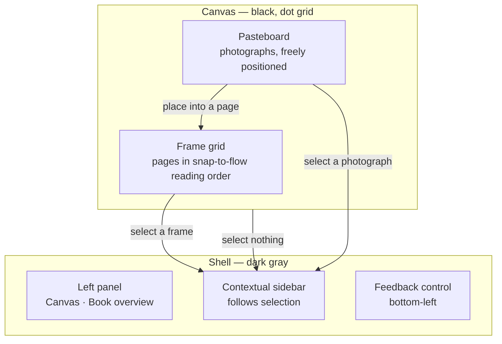
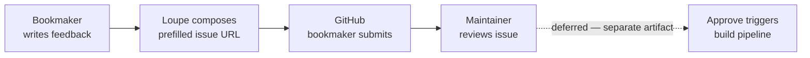
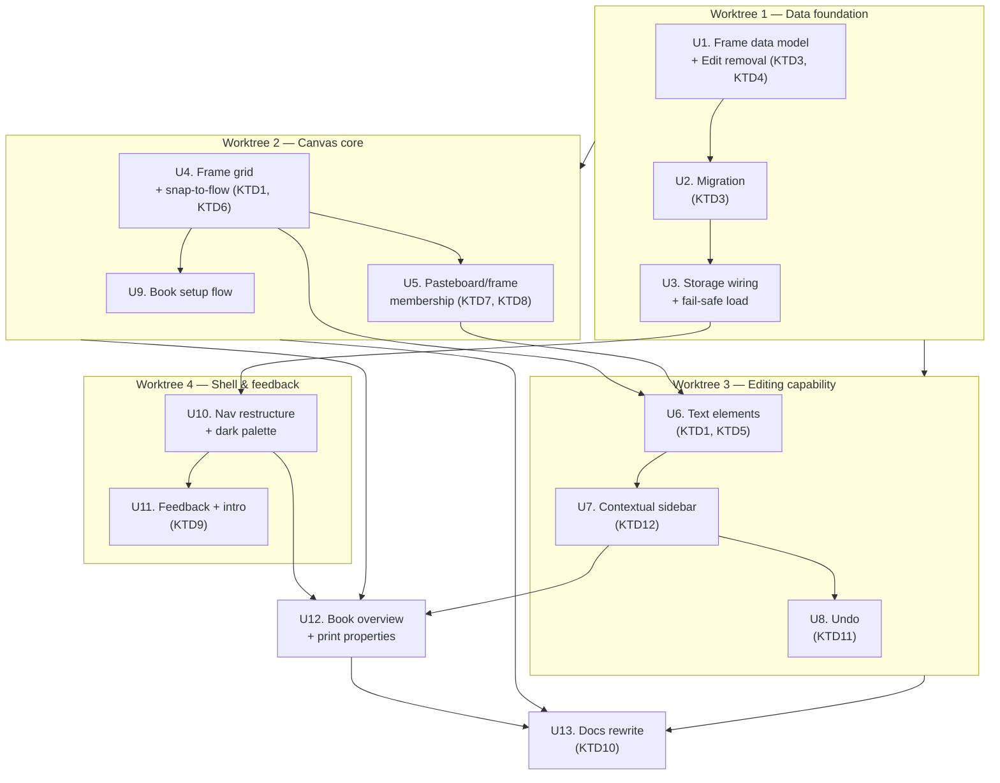

# Unified Canvas - Plan

## Goal Capsule

- **Objective:** Collapse Loupe's three-mode structure into a single canvas where pages are frames, selection drives a contextual sidebar, and the app invites its users to shape it.
- **Product authority:** This plan supersedes the three-mode UX thesis in `docs/plans/00-initial-build-brief.md` and the funnel semantics in `CLAUDE.md`. Both documents are rewritten as part of this work.
- **Open blockers:** None.
- **Product Contract preservation:** unchanged by this enrichment pass. R13 and R14 were reworded during the requirements doc's own `ce-doc-review` round, before this planning pass began, to resolve a per-page/book-level print-property split; that resolution is carried forward as-is, not introduced here. Every other R/A/F/AE ID, Key Decision, and Scope Boundary is untouched by planning. This enrichment adds the Planning Contract, Implementation Units, Verification Contract, and Definition of Done below. Confirmed with the user this session: only two stages exist going forward — the unified canvas (sequencing, layout, and composition together) and the Book overview (high-level, per-page print specs) — with tighter integration between them left for a later session.

---

## Product Contract

### Summary

Loupe becomes one canvas. Importing photographs prompts for book size and page count, which lays down page frames in a snap-to-flow grid with the photographs staged above them. Clicking anything — text, image, frame, or empty space — populates a persistent contextual sidebar, and the Sequence / Design / Print modes disappear. A feedback control files GitHub issues, and the empty canvas introduces the project as an open experiment in growing software with its users.

### Problem Frame

The three-mode structure was designed as three cognitive tasks with clean engine boundaries. In practice it produced three places to be and a funnel between them — Canvas, Edits, Book — where the relationship between stages had to be learned rather than seen. The author of the tool found the model didn't read clearly when looking at it. That is a legibility failure rather than a workflow failure, but the two have the same fix here: a photographer laying prints on a table does not switch modes, and does not maintain a separate list that mirrors what the prints already show.

The current build makes this concrete. Design mode renders pages but nothing on a page can be moved — neither text nor images are interactive, so "design" is a preview. Sequencing lives in an ordered list of asset ids that is deliberately disconnected from where photographs sit on the light table. The two representations of an ordering never meet, and the user has to hold the correspondence in their head.

No book has been made with the tool yet, so none of this comes from observed friction. The bet is that a single spatial surface removes the need for the correspondence entirely.

### Key Decisions

- **One canvas, no modes.** Sequence, Design, and Print stop being places the user navigates to. What the sidebar shows is determined by what is selected, so the mode is implied by the work rather than chosen in advance. *(session-settled: user-directed — chosen over keeping the three-mode structure with modes relocated to the top-centre nav: selection context replaces navigation entirely, which makes the nav move moot.)*

- **Page order comes from a snap-to-flow grid.** Frames arrange themselves in reading order; dragging a frame between two others inserts it there and reflows the rest. Position is order, without inference. *(session-settled: user-approved — chosen over free placement with ordering in the Book panel, and over free placement with order read spatially: the first makes canvas dragging merely cosmetic, the second is ambiguous the moment frames are not cleanly aligned.)*

- **Empty selection shows book settings.** Page size, page count, imposition, and saddle-stitch validation are properties of the book, not of any page. Clearing the selection reveals them rather than emptying the sidebar. *(session-settled: user-approved — chosen over fading the sidebar to nothing: book-level settings would otherwise have no home once the setup prompt is dismissed.)*

- **Direct manipulation on the canvas, precision in the sidebar.** Elements are created and positioned by gesture; width, type role, and alignment are set numerically in the sidebar. Resize handles, snapping, and multi-select are not part of this work. *(session-settled: user-approved — chosen over full Figma-style manipulation and over sidebar-only form fields: the first is a large direct-manipulation build on DOM elements, the second leaves images immovable.)*

- **Dark only.** One committed palette rather than two. *(session-settled: user-directed — chosen over maintaining a light-mode equivalent and over defaulting to dark while leaving light unconsidered: a single look halves every future styling decision.)*

- **Feedback opens a prefilled GitHub issue.** The control composes a title and body and hands the user to GitHub to submit under their own account. *(session-settled: user-approved — chosen over a serverless function holding a scoped token, and over a hybrid of both: no token can ship in client JS, and the prefill path adds no backend, no abuse surface, and no change to the no-backend rule.)*

- **The introduction lives in the empty canvas, with a permanent way back.** First-time visitors read what Loupe is and why it exists in the space they are already looking at; it steps aside once they import, and a bottom-left control — beside the feedback control — brings it back at any time. *(session-settled: user-approved — chosen over a first-load modal and over a footer link alone: the canvas is already empty on arrival, so a modal explains the app in a box on top of a blank screen.)*

### Actors

- A1. **The bookmaker** — a photographer sequencing and designing a photobook or zine. Works entirely in the browser, local-first, with no account.
- A2. **The maintainer** — the project owner, who receives feedback as GitHub issues and decides what gets built.

### Requirements

**Book setup**

- R1. Completing an import prompts the bookmaker for the book's parameters before any frame appears.
- R2. The prompt offers three or four common photobook size presets alongside fully custom dimensions.
- R3. The prompt captures how many pages the book starts with.
- R4. Book parameters remain editable after setup, from the book-level sidebar state.
- R26. Changing page size preserves each element's normalized position within its frame; where the new size changes the aspect ratio, photographs keep their own aspect and re-fit rather than distorting. Reducing page count never silently discards a page holding content.

**Canvas composition**

- R5. Each page renders as a frame on the canvas at the true proportion of the chosen page size.
- R6. Frames occupy a snap-to-flow grid whose position determines reading order.
- R7. Dragging a frame between two others inserts it at that position and reflows every frame after it.
- R8. Imported photographs stage on a pasteboard above the frame grid, positioned freely rather than flowed.
- R9. Photographs move between the pasteboard and a frame, and between frames.
- R27. While a frame is dragged, the grid shows where it will land, including the positions before the first frame and after the last.
- R28. Canvas actions are undoable — reordering a frame, moving a photograph between frames, creating or deleting an element, and editing text.

**Contextual sidebar**

- R10. One persistent sidebar shows the properties of the current selection — or book-level settings when nothing is selected, per R14 — and nothing else.
- R11. Selecting text shows its type role, alignment, and width.
- R12. Selecting a photograph shows its fit and frame position.
- R13. Selecting a page frame shows that page's margins — the one print property that can vary per page.
- R14. Clearing the selection shows book-level settings: page size, page count, saddle-stitch validation, and imposition, since imposition is a property of the whole book and never varies by page.
- R15. The sidebar animates between selection states rather than appearing and disappearing abruptly.
- R29. Changing the selection commits any in-progress edit rather than discarding it — a half-typed caption or an unconfirmed sidebar value is kept, not lost.

**Editing**

- R16. The bookmaker creates a text box with the `T` key or a tool control. The `T` key is inert whenever a text box has editing focus, so typing a word containing "t" never creates a second box.
- R17. Text and photographs are repositioned by dragging them directly.
- R18. Text content is edited in place on the canvas.
- R30. Every canvas action reachable by drag — selecting a frame, a photograph, or text; reordering a frame; moving a photograph into a frame — is also reachable from the keyboard, so removing the mode toggles does not remove keyboard access to the canvas.

**Structure**

- R19. The Sequence, Design, and Print toggles are removed from the interface.
- R20. The left panel offers the canvas and a book overview listing pages in reading order.

**Appearance**

- R21. The application renders in a single dark palette with no theme toggle.
- R22. The canvas surface is black with a subtle dot grid; the shell adopts the gray the canvas currently uses.
- R31. Selection outlines, frame edges, and the drag insertion indicator (R27) stay clearly visible against the black canvas and the dot grid at all times, independent of how subtle the grid itself is.

**Feedback loop**

- R23. A feedback control sits in the bottom-left corner of the application.
- R24. Submitting composes the bookmaker's message into a prefilled GitHub issue URL and hands off to GitHub.
- R25. The empty canvas introduces Loupe as an open experiment in growing software with its users, and disappears once photographs are imported.
- R32. The introduction is reachable again at any time from a persistent control in the bottom-left corner, alongside the feedback control (R23) — dismissal on import is not permanent.

### Structure of the canvas



Two object classes share the canvas under different rules: photographs on the pasteboard float, page frames flow. That split is what lets dragging mean "arrange loosely" in one region and "reorder the book" in the other.

### Key Flows

- F1. **First run to first frame**
  - **Trigger:** A new visitor opens Loupe with an empty project.
  - **Actors:** A1
  - **Steps:** The empty canvas introduces the project and invites photographs. The bookmaker imports. The setup prompt asks for page size and page count. Frames appear in the grid; the photographs land on the pasteboard above them.
  - **Outcome:** A book of the requested length exists as frames, with every imported photograph staged and unplaced.
  - **Covered by:** R1, R2, R3, R5, R8, R25

- F2. **Sequencing**
  - **Trigger:** The bookmaker drags a page frame toward a different position in the grid.
  - **Actors:** A1
  - **Steps:** The grid indicates the insertion point. On release the frame takes that position and every subsequent frame reflows. Page numbers update.
  - **Outcome:** Reading order matches what is on screen, with no separate list to reconcile.
  - **Covered by:** R6, R7, R20

- F3. **Composing a page**
  - **Trigger:** The bookmaker drags a photograph from the pasteboard into a frame, or presses `T` over one.
  - **Actors:** A1
  - **Steps:** The element lands in the frame and becomes the selection. The sidebar shows that element's properties. The bookmaker drags to position and sets precise values in the sidebar; text is typed in place.
  - **Outcome:** The page holds composed content, with no mode switch at any point.
  - **Covered by:** R9, R11, R12, R16, R17, R18

- F4. **Sending feedback**
  - **Trigger:** The bookmaker activates the feedback control.
  - **Actors:** A1, A2
  - **Steps:** The bookmaker writes what they want. Loupe composes a prefilled GitHub issue URL and opens it. The bookmaker submits under their own account. The maintainer receives the issue.
  - **Outcome:** Attributed feedback lands in the repo's issue tracker with no backend involved.
  - **Covered by:** R23, R24



### Acceptance Examples

- AE1. **Covers R7.** Given a twelve-page book, when the bookmaker drags the frame at position 9 and drops it between positions 2 and 3, then it becomes page 3 and the frames formerly at 3 through 8 each shift one position later.
- AE2. **Covers R14.** Given a photograph is selected and the sidebar shows its properties, when the bookmaker clicks empty canvas, then the sidebar transitions to book-level settings rather than emptying.
- AE3. **Covers R14.** Given a book of 10 pages, when the bookmaker views book-level settings, then saddle-stitch validation reports that the page count is not a multiple of four.
- AE4. **Covers R25.** Given a returning visitor with photographs already imported, when they open Loupe, then the introduction does not appear and the canvas shows their work.
- AE5. **Covers R4, R26.** Given a book set up at page size A5 with a photograph and a caption already placed on one frame, when the bookmaker changes the page size to a custom dimension with a different aspect ratio, then the frame re-proportions, the caption keeps its normalized position, and the photograph re-fits to its own aspect rather than distorting.
- AE6. **Covers R24.** Given the bookmaker has written feedback, when they submit, then GitHub opens with the issue form already populated and nothing has been sent from Loupe itself.
- AE7. **Covers R16.** Given a text box on the canvas has editing focus, when the bookmaker types a sentence containing the letter "t", then no new text box is created.
- AE8. **Covers R29.** Given the bookmaker is mid-edit in a sidebar field, when they click a different frame, then the in-progress edit commits before the sidebar switches to the new selection.
- AE9. **Covers R32.** Given a bookmaker has already imported photographs and dismissed the introduction, when they click the bottom-left introduction control, then the introduction reappears.

### Scope Boundaries

**Deferred for later**

- The automation pipeline that turns an approved issue into a pull request. It is repo infrastructure rather than product code, and gets its own conversation and artifact.
- The imposition engine itself. Frame selection surfaces print settings; it does not generate folded output.
- Competing candidate sequences. One canvas means one ordering, so comparing two versions of a book side by side stops being possible.
- Resize handles, snapping, and multi-select on canvas elements.
- Mobile and tablet layouts. The application stays desktop-only.

**Outside this product's identity**

- Accounts, login, and email capture.
- Any backend beyond the existing thin serverless surface for payment.
- License enforcement, phone-home validation, or DRM.

### Dependencies / Assumptions

- The restructure invalidates the three-mode UX thesis in `docs/plans/00-initial-build-brief.md` and the Sequence funnel, one-way snapshot semantics, and geometry rule in `CLAUDE.md`. Rewriting both is part of this work, not a follow-up.
- `core/` must stay free of React, Next, Fabric, and Stripe imports. Frame flow and page-order math belong in `core/`; the canvas surface stays in `apps/web/`.
- The existing `Edit` type and its commit-to-pages path lose their purpose. Whether the type is deleted or left dormant is a planning decision.
- Existing projects in IndexedDB predate frames and carry `edits` and `pages` in their current shape. A migration path is assumed but unspecified.
- Motion work — sidebar transitions, frame reflow, introduction dismissal — follows the `animations` skill rather than ad-hoc timing values.
- Implementation runs in isolated git worktrees via `ce-worktree`, with subagents on Sonnet 5.
- Feedback assumes a public GitHub repository whose issue tracker accepts submissions from any authenticated account.

### Outstanding Questions

Four items were deferred to planning in the requirements-only version of this document — migration path, dot-grid zoom behavior, pasteboard/grid spatial relationship, and the `T`-shortcut mechanism. All four were resolved during this planning pass as Key Technical Decisions KTD3, KTD6, KTD7, and KTD5 respectively — see Planning Contract below.

### Sources / Research

- `core/src/types.ts` — the current data model. `CanvasPlacement` stores centers in scene units; `Edit.memberIds` holds asset ids; `Page.elements` uses normalized `Box` frames. The normalized `Box` already supports positioning inside a frame.
- `apps/web/components/shell/canvas-region.tsx` — mode routing at lines 47-51, and `DesignPage` at line 232 confirming Design mode renders plain DOM with no interaction layer.
- `apps/web/components/shell/mode-switcher.tsx` and `inspector-panel.tsx` — the right panel is built to grow downward out of the floating mode switcher, a relationship that ends with the toggles.
- `apps/web/components/theme-provider.tsx` — `next-themes` with `defaultTheme="system"` and a bare `D` hotkey, both removed by the dark-only decision.
- `apps/web/app/globals.css` — current palette. Dark `--background` is `oklch(0.141 0.005 285.823)` and `--muted` is `oklch(0.274 0.006 286.033)`; the canvas currently renders `bg-muted/40`, which becomes the shell color.
- https://dirtylittlezine.com — the reference. Ships `--stage: #18181b` against `--sidebar: #e8e8e6`, confirming the dark-workspace-lighter-chrome relationship, and a `--halftone` radial-gradient dot pattern. Its four modals are all user-triggered; there is no first-load intro and no first-visit flag in storage. Its text model is sidebar form fields with a font picker, not draggable boxes.
- `apps/web/components/sequence/use-fabric-canvas.ts` — the existing Fabric v7 canvas hook. Already owns object add/remove, drag-to-modify events wired to store writes, per-object locked controls, and a discriminated `PlacedObject` type carrying app-level identity on a Fabric object. This is the substrate the unified canvas extends (KTD1).
- `core/src/collections.ts` (`moveItem`), `core/src/sequence.ts` (`movePage`) — the existing reorder primitive, already shared between page order and Edit-member order. Frame reordering (R7) reuses `moveItem` rather than a third implementation.
- `core/src/geometry.ts` (`layoutNewPlacements`) — the existing grid-below-existing-content import layout. The pasteboard's growth pattern (KTD7) follows this precedent rather than inventing a new one.
- `apps/web/lib/storage/db.ts`, `project.ts` — IndexedDB schema (`originals`, `thumbnails`, `project` stores) and the existing debounced/immediate save split. Migration (KTD3) runs in `loadProject`, alongside the existing orphaned-blob reconciliation.
- `apps/web/components/shell/error-banner.tsx` — existing UI for surfacing `lastError` from the store; the fail-safe migration path (KTD3) reuses this rather than introducing a second error surface.
- `apps/web/package.json` — no `motion`/`framer-motion` dependency. Sidebar and canvas motion (KTD12) uses CSS transitions and Fabric's own `.animate()`, per the `animations` skill's "match the project's stack" rule.
- `docs/solutions/` contains only `.gitkeep` — no institutional learnings corpus exists yet to search.
- `todos/2026-08-22-unified-canvas-doc-review.md` — the full `ce-doc-review` finding record. Items not resolved into this plan (success signal for the one-canvas bet, the loss of competing candidate sequences, the deleted engine-simplicity rationale) are product-level and intentionally not re-opened here; they remain live questions for a future session.

---

## Planning Contract

### Key Technical Decisions

- **KTD1 — Extend the existing Fabric v7 canvas; do not build a second DOM interaction system.** `use-fabric-canvas.ts` already provides object lifecycle, drag-to-store-write wiring, and per-object locked controls, and Fabric's `Textbox` gives inline text editing natively — satisfying R18 without custom contentEditable handling. Design mode's current plain-DOM `DesignPage` is deleted rather than extended; building a second, parallel interaction layer there would duplicate what Fabric already does correctly. Resolves the "which substrate" question flagged in review.

- **KTD2 — No virtualization for off-screen frames in v1.** Canvas rendering is comparatively cheap next to DOM re-renders; `use-fabric-canvas.ts` already batches redraws through `requestRenderAll` rather than rendering per-mutation, which keeps a full book's worth of frames tractable at the sizes this product targets (a photobook, not a thousand-page document). Fabric's `objectCaching` is available but not yet used anywhere in this codebase — it is the escape hatch if a real book proves this assumption wrong (applied per-frame, to frames outside the viewport), not something already in place. This narrows the "engine simplicity" review finding to a specific, falsifiable claim about rendering cost — it does not resolve the broader product question of whether losing "only one mode renders live" as a structural property is itself acceptable, which stays open in `todos/2026-08-22-unified-canvas-doc-review.md`. Concrete trigger for the escape hatch: if dragging a frame drops below 30fps in a 40+ page book during manual verification, add `objectCaching` to frames outside the current viewport before shipping the unit that regressed.

- **KTD3 — Migration seeds frames from committed pages only; `Edit` is not auto-converted.** `Page.elements` already carries normalized `Box` frames per element — those map directly onto the new frame model. An `Edit`'s `memberIds` is an ordered list of asset ids with no layout information, so converting it into composed frames would invent placement the user never made. Migration therefore: (1) seeds one frame per existing `Page`, preserving element positions; (2) drops `Edit` records after the migrated shape validates; (3) leaves any unplaced pasteboard photographs untouched. The migrated shape is validated in memory before it overwrites the stored record — a validation failure loads the project read-only with an `ErrorBanner` message rather than writing anything, so a bad migration cannot destroy the only copy of a user's work.

- **KTD4 — The `Edit` type is deleted, not left dormant.** No requirement (R1–R32) references it, and the brief's own principle is "don't keep code around 'just in case.'" `createEdit`, `addToEdit`, `removeFromEdit`, `reorderEditMember`, `renameEdit`, `duplicateEdit` in `core/src/edits.ts`, the `edits` field on `Project`, and every store method touching it are removed in the same unit that introduces frames, so there is one commit where the model changes shape rather than a lingering unused path.

- **KTD5 — `T` creates a text box and enters edit mode immediately, centered in the current viewport** — not at the last pointer position, and not an armed click-to-place gesture. Viewport-center is simpler to build and test than tracking pointer recency, and is consistent with the settled "gesture creates, sidebar refines" decision. Resolves the review's open T-mechanism question.

- **KTD6 — The dot grid scales with canvas zoom**, tied to the same viewport transform Fabric already applies to placed objects (`use-fabric-canvas.ts`'s zoom/pan handlers). A screen-fixed grid would visibly detach from the frames and photographs the moment the user zooms, undermining the "real infinite canvas" read the grid exists to produce.

- **KTD7 — The pasteboard is a fixed band above the frame grid that grows downward with imported content**, mirroring `layoutNewPlacements`'s existing "grid below whatever is already there" pattern. The frame grid begins below the pasteboard's current extent and itself grows downward as pages are added. This keeps the two regions visually and computationally distinct without a second coordinate system.

- **KTD8 — Pasteboard/frame membership is decided by the moved element's center point.** An element joins a frame when its center falls inside that frame's bounds on drop; otherwise it stays on the pasteboard. This mirrors the existing center-anchored placement model (`CanvasPlacement.x/y` is already a center, per `core/src/types.ts`) rather than introducing an overlap-percentage or edge-proximity rule.

- **KTD9 — The feedback body is capped at 2,000 characters, percent-encoded via the platform URL API, with a live counter and a disabled submit past the cap.** Comfortably under GitHub's and browsers' practical URL-length ceilings, so truncation never happens silently. The composed body contains only the bookmaker's typed text and static template boilerplate — no project name, filenames, or asset metadata are ever appended, closing the scope-creep risk the review flagged for this public, permanent channel.

- **KTD10 — The `CLAUDE.md` / build-brief rewrite is bounded to named sections**, not open-ended. In `CLAUDE.md`: replace "Three modes, three cognitive tasks" and "The Sequence funnel" with the two-stage canvas/book model; update the geometry rule in "Data model notes" (`CanvasPlacement.x/y` center-anchoring still holds; the "order is never inferred from position" line is corrected per KTD-derived snap-to-flow semantics); remove the `Mode`/`SequenceStage` references under "Fabric.js v7 gotchas" if any exist. In the build brief: mark "Three-mode UI" as superseded with a pointer to this plan, leave the pricing/tier and audience sections untouched. This is U13 below, executed last so the docs describe what actually shipped.

- **KTD11 — Undo is a command stack scoped to canvas mutations, held in the editor store, not a generic time-travel history.** Each undoable action (frame reorder, element move between frames, element create/delete, text edit commit) pushes a paired do/undo closure; the stack is cleared on project load. This is the minimum that satisfies R28 without adopting a general state-snapshot library the project doesn't otherwise need.

- **KTD12 — Sidebar and canvas motion uses CSS transitions and Fabric's `.animate()`, not a new animation dependency.** No `motion`/`framer-motion` package exists in `apps/web/package.json`; per the `animations` skill's "match the project's stack" rule, the sidebar cross-fade (R15) is a CSS transition on `transform`/`opacity` (200–250ms, `ease-out` on enter), and frame reflow (R7) uses Fabric's built-in `animate()` for the position tween (`ease-in-out`, under 300ms) rather than hand-rolled `requestAnimationFrame` tweening.

### High-Level Technical Design

**Implementation unit dependency graph**, grouped by worktree per the user's `ce-worktree` constraint. An arrow means "must land first":



Worktree 1 runs alone first — everything else depends on the frame data model existing. Worktree 3 is not fully parallel to Worktree 2, despite both branching from Worktree 1: U6 depends directly on U4 and U5, so Worktree 3's chain (U6 → U7 → U8) cannot start until those two Worktree 2 units land, even though U9 (also in Worktree 2) can proceed independently of U6. Worktree 4's shell work only needs U3's storage wiring, so it can start alongside Worktree 2. U12 and U13 are integration points that wait on the worktrees they cite (U12 additionally needs U10, not shown by omission above) and are best done back in the primary branch after the worktree branches merge.

### System-Wide Impact

- **`core/`** gains the frame/migration/undo-command data model and loses `edits.ts` entirely (KTD1, KTD3, KTD4, KTD11). The React/Next/Fabric/Stripe-free boundary is preserved: frame flow, hit-testing math, and migration logic are pure functions over `Project`, exactly like the existing `sequence.ts` and `geometry.ts`.
- **`apps/web/components/sequence/`** absorbs almost all UI work — `workflow-tree.tsx` and `edit-stage.tsx` are deleted (KTD4); `light-table.tsx` is substantially rewritten to host the frame grid and pasteboard; `use-fabric-canvas.ts` is extended, not replaced.
- **`apps/web/components/shell/`** loses `mode-switcher.tsx` and the mode-routing branches in `canvas-region.tsx`; `inspector-panel.tsx` becomes the contextual sidebar.
- **`apps/web/components/theme-provider.tsx`** is deleted; `next-themes` is removed from `apps/web/package.json`.
- **Two governing documents change** (KTD10): `CLAUDE.md` and `docs/plans/00-initial-build-brief.md`, both bounded to named sections in U13.
- **No test tooling exists in `apps/web`** — only `core/` runs Vitest today. This plan does not introduce a UI test runner; per-unit Verification below routes `core/` logic through Vitest (matching `geometry.test.ts`'s existing conventions) and routes `apps/web` behavior through manual/browser verification via the `run` skill, which is an honest continuation of the existing project convention rather than a new gap this plan creates.

---

## Implementation Units

### U1. Frame data model and Edit removal

**Goal:** Introduce the frame-based data model in `core/` and remove the `Edit` type in the same change, so there is no interim state where both models coexist.

**Requirements:** R5, R6, R8, R9, R19, R20 (data-model prerequisites); KTD3, KTD4

**Dependencies:** None — this is the first unit.

**Files:**
- `core/src/types.ts` — add a `Frame` type (page-in-progress on the canvas: id, page size reference, ordered position, elements) and a book-setup shape (page size preset/custom, page count); remove `Edit`; update `Project` to drop `edits` and add `frames`.
- `core/src/edits.ts` — delete.
- `core/src/frames.ts` — new: frame creation, the snap-to-flow reorder function (wrapping `moveItem` from `collections.ts`), and the hit-test function for KTD8 (element center inside frame bounds).
- `core/src/frames.test.ts` — new.
- `core/src/index.ts` — update exports (drop `edits`, add `frames`).
- `apps/web/state/editor-store.ts` — remove all `Edit`-related state and methods (`newEdit`, `addAssetToEdit`, `newEditFromAsset`, `removeAssetFromEdit`, `moveEditMember`, `renameEditById`, `duplicateEditById`, `deleteEdit`, `commitEditToBook`, `activeEditId`, `sequenceStage`); add frame state and mutations.
- `apps/web/components/sequence/workflow-tree.tsx`, `edit-stage.tsx` — delete. These are the only consumers of the store methods removed above; deleting them here, not in U10, means the build is never in a state where Worktree 2 or 3 could branch from code that references a removed method.

**Approach:** `Frame` carries the same normalized `Box`-per-element shape `Page` already uses (from `types.ts`), so `PageElement` (`ImageElement` | `TextElement`) is reused rather than redefined — a frame is structurally a page that also has a grid position. The reorder function is `frames.ts`'s thin wrapper around the existing `moveItem`, not a new algorithm. Deleting the Edits UI in the same unit that deletes the store methods it depends on is deliberate: it is what makes this unit's stated goal ("no interim state where both models coexist") actually true across the worktree boundary, not just within `core/`.

**Patterns to follow:** `core/src/edits.ts`'s pure, id-and-clock-free function style; `core/src/sequence.ts`'s `movePage` as the direct precedent for frame reordering.

**Test scenarios:**
- Happy path: creating a frame from a book-setup call produces the expected page size and empty element list.
- Happy path: reordering a frame via the wrapped `moveItem` produces the same shift behavior AE1 describes (drag 9 to between 2 and 3 → frames 3–8 shift one position later).
- Edge case: reordering to before the first or after the last frame (boundary index).
- Edge case: hit-test with an element center exactly on a frame's boundary pixel.
- Edge case: hit-test with no frame under the element (stays on pasteboard).

**Verification:** `core/src/frames.test.ts` passes under `npm test --workspace=@loupe/core`; `rg "from ['\"]edit" core/src apps/web` returns nothing outside this unit's own deletions; the core purity gates in `CLAUDE.md` (`rg` for React/Next/Fabric/Stripe imports and DOM globals in `core/src`) still return nothing.

---

### U2. Migration

**Goal:** Convert an existing IndexedDB project (`edits` + `pages`, pre-frame shape) into the frame model, non-destructively.

**Requirements:** R (none directly — infrastructure enabling all frame-dependent requirements); KTD3

**Dependencies:** U1

**Files:**
- `core/src/migration.ts` — new: pure function `migrateProject(legacy: LegacyProject): MigrationResult` returning either a validated frame-shaped `Project` or a failure reason.
- `core/src/migration.test.ts` — new.

**Approach:** One frame per existing `Page`, in existing order, with that page's elements copied verbatim (their `Box` frames already normalize correctly onto the new `Frame`). `Edit` records are read only to confirm they exist, never converted, then omitted from the output. Validate the result (frame count matches page count, no element references a missing asset) before returning it as success; any check failing returns a typed failure the caller must not write to storage.

**Execution note:** Test-first — write the failure-path tests before the happy path, since a migration bug's failure mode is silent data loss, not a visible crash.

**Test scenarios:**
- Happy path: a project with 5 committed pages migrates to 5 frames with elements intact.
- Happy path: a project with only `edits` and no `pages` migrates to an empty frame set (nothing lossy is invented) with `edits` present in the input but absent from the output.
- Edge case: an empty project (no pages, no edits, no assets) migrates to an empty frame set without error.
- Edge case: a page element referencing a missing `assetId` fails validation rather than producing a dangling frame element.
- Error path: malformed input (missing required fields) returns a typed failure, never throws.

**Verification:** `core/src/migration.test.ts` passes; a failure-path test exists for every validation check named above.

---

### U3. Storage wiring and fail-safe load

**Goal:** Wire `migrateProject` into the load path so an old project migrates on read, and a migration failure degrades to read-only rather than corrupting the stored record.

**Requirements:** KTD3

**Dependencies:** U2

**Files:**
- `apps/web/lib/storage/project.ts` — `loadProject` calls `migrateProject` when the stored record predates frames; on success, writes the migrated shape back via the existing `saveProject` immediate-write path; on failure, returns the project unmigrated with a flag the store surfaces.
- `apps/web/state/editor-store.ts` — `hydrate` reads the failure flag and sets `lastError` (reusing the existing `ErrorBanner` surface) with a message distinguishing "could not load your project" from the existing "storage unavailable" case.

**Approach:** Detect pre-frame shape by the presence of an `edits` field or absence of a `frames` field on the loaded record — no version field exists today, so shape-sniffing is the only option without a wider storage-schema change this plan doesn't otherwise need.

**Test scenarios:**
- Integration: loading a pre-frame project triggers migration and the migrated shape is what subsequent `project.frames` reads see.
- Integration: a successful migration persists immediately (reusing `saveProject`, not the debounced path), matching the existing "blobs already on disk" urgency rule in `project.ts`.
- Error path: a migration failure surfaces via `lastError` and does not call `saveProject` — the original stored record is provably untouched (assert via a second raw read from `db.get`).

**Verification:** Manual/browser check via the `run` skill — seed IndexedDB with a hand-crafted pre-frame project record, reload, confirm frames appear and the original store key is unchanged until success is confirmed; core migration logic itself is covered by U2's Vitest suite.

---

### U4. Frame grid and snap-to-flow

**Goal:** Render frames on the Fabric canvas in a snap-to-flow grid; dragging a frame reorders and reflows.

**Requirements:** R5, R6, R7, R27, R31; KTD1, KTD6

**Dependencies:** U1 (data model), U3 (frames must load from somewhere)

**Files:**
- `apps/web/components/sequence/use-fabric-canvas.ts` — extend to draw frame objects (Fabric `Rect` or `Group`) in addition to pasteboard image objects; add a `PlacedFrame` variant of the existing `PlacedObject` discriminated type.
- `apps/web/components/sequence/frame-grid.ts` — new: pure-JS-but-DOM-adjacent grid layout (screen/scene position for a given frame index and page size), kept out of `core/` because it reasons about viewport pixels, not scene units.
- `apps/web/components/sequence/canvas-region.tsx` — remove the `mode`-based routing at the current lines 47–51; the unified canvas becomes the only render path.

**Approach:** Reuse `use-fabric-canvas.ts`'s existing `object:modified` event to detect a frame drag ending, then call the `frames.ts` reorder function (U1) and re-lay-out every frame's screen position from `frame-grid.ts`. The insertion-point indicator (R27) is a Fabric object shown during `mouse:move` while a frame drag is active, removed on `mouse:up` — following the existing pattern of ephemeral overlay objects the hook doesn't yet have but `PromotionMenu` in `light-table.tsx` demonstrates for non-canvas ephemeral UI.

**Execution note:** Motion (KTD12) — the reflow tween after a drop uses Fabric's `.animate()` at under 300ms, `ease-in-out`; do not hand-roll the tween loop.

**Technical design:**
```
onFrameDragEnd(frame, dropPosition):
  targetIndex = gridIndexAt(dropPosition)      // frame-grid.ts
  newFrameOrder = reorderFrames(frames, frame.index, targetIndex)  // core, U1
  store.setFrames(newFrameOrder)
  for each frame whose index changed:
    animateToGridPosition(frame, frame-grid.ts position, {duration: <300ms, ease-in-out})
```
This is directional — the exact Fabric API calls (`fabric.util.animate` vs. object `.animate()`) are an implementation detail for the unit, not specified here.

**Test scenarios:**
- Happy path: dragging a frame to a new grid position calls the reorder function with the correct from/to indices and re-renders every affected frame at its new position (AE1).
- Edge case: dropping a frame at the exact position it started (no-op reorder, no unnecessary animation).
- Edge case: dropping before the first frame or after the last (R27's stated boundary case).
- Integration: reordering persists to the store and survives a re-render (frames stay in the new order after an unrelated state change).

**Verification:** Manual/browser check via the `run` skill — drag a frame among a 6+ page book and confirm AE1's exact shift behavior; visually confirm the insertion indicator appears mid-drag and the reflow animates rather than snapping instantly.

---

### U5. Pasteboard/frame membership

**Goal:** Photographs move freely on the pasteboard and join or leave frames by drop position.

**Requirements:** R8, R9; KTD7, KTD8

**Dependencies:** U4

**Files:**
- `apps/web/components/sequence/use-fabric-canvas.ts` — on `object:modified` for a pasteboard image, run the KTD8 hit-test against current frame bounds (from `frame-grid.ts`) and, on a hit, move the element from pasteboard state into that frame's element list.
- `core/src/frames.ts` — add the pure `assignToFrame`/`removeFromFrame` functions the hook calls into.
- `core/src/frames.test.ts` — extend.

**Approach:** The pasteboard region's vertical extent comes from `frame-grid.ts` (KTD7 — grid starts below the pasteboard's current content bounds, reusing `layoutNewPlacements`'s bounding-box logic from `geometry.ts`).

**Test scenarios:**
- Happy path: dropping a pasteboard photograph with its center over a frame moves it into that frame's elements.
- Happy path: dropping a photograph already in a frame onto a different frame moves it between frames.
- Edge case: dropping exactly on a frame boundary — center-point rule from KTD8 decides which side wins.
- Edge case: dragging a frame element back out to the pasteboard removes it from the frame's element list.

**Verification:** Manual/browser check — drag a photo from the pasteboard into a frame, confirm it appears in that frame's content and the sidebar (once U7 lands) shows it as selected there.

---

### U6. Text elements

**Goal:** Create and inline-edit text on the canvas via `T` or a tool control.

**Requirements:** R16, R17, R18, AE7; KTD1, KTD5

**Dependencies:** U4, U5

**Files:**
- `apps/web/components/sequence/use-fabric-canvas.ts` — add Fabric `Textbox` creation and wire its native `editing:entered`/`editing:exited` events to store updates.
- `apps/web/components/sequence/use-canvas-shortcuts.ts` — extend with the `T` handler, guarded by "no `Textbox` currently has editing focus" (mirrors this file's existing pattern of checking `isTypingTarget`-style guards, though here the check is against Fabric's own editing state rather than a DOM element).

**Approach:** `T` (KTD5) creates a `Textbox` centered in the current viewport, immediately calls Fabric's `enterEditing()`, and the guard against re-firing while already editing is Fabric's own `canvas.getActiveObject()?.isEditing` check — no new focus-tracking state needed.

**Test scenarios:**
- Happy path (AE7): typing a sentence containing "t" while a Textbox is being edited does not create a second Textbox.
- Happy path: pressing `T` with nothing in edit mode creates a new Textbox and enters edit mode immediately.
- Edge case: pressing `T` while a non-text object (frame or image) is selected still creates a new Textbox rather than acting on the selected object.
- Integration: exiting text edit (click elsewhere) commits the text content to the underlying `TextElement` data.

**Verification:** Manual/browser check — confirm AE7's exact scenario (type "The" into an active text box, confirm no second box appears).

---

### U7. Contextual sidebar

**Goal:** One sidebar reflecting the current selection, or book settings when nothing is selected, with an animated transition and edit-commit-on-reselect.

**Requirements:** R10, R11, R12, R13, R14, R15, R29, AE2, AE3, AE8; KTD12

**Dependencies:** U6 (text elements must exist to show their properties)

**Files:**
- `apps/web/components/shell/inspector-panel.tsx` — rewrite as the contextual sidebar: branches on `Selection` (`text` | `image` | `frame` | `null` → book settings).
- `apps/web/components/shell/mode-switcher.tsx` — delete (no modes to switch between).
- `apps/web/state/editor-store.ts` — `commitPendingEdit()` method called before any selection change, per R29.

**Approach:** The `Selection` type in `core/src/types.ts` already discriminates `page` | `element` | `null` — extend it to discriminate `frame` | `text-element` | `image-element` | `null`, and branch the sidebar render on that. R29's commit-before-reselect is enforced at the single call site that changes `selection` in the store, not scattered across every UI entry point that can trigger a selection change.

**Execution note:** Motion (KTD12) — the sidebar cross-fade between selection states is a CSS transition on `opacity`/`transform` (200–250ms `ease-out` on enter, ~180ms `ease-in` on exit per the animations skill's asymmetric enter/exit rule), gated behind `prefers-reduced-motion`.

**Test scenarios:**
- Happy path: selecting text shows role/alignment/width fields (R11); selecting a photograph shows fit/position (R12); selecting a frame shows margins only (R13).
- Happy path (AE2, AE3): clearing selection shows book settings including saddle-stitch validation output from the existing `checkPageCount`.
- Edge case (AE8): a half-typed sidebar field commits when the user clicks a different frame before finishing.
- Edge case: selecting an object of a kind the sidebar doesn't yet have a branch for (defensive — should not happen once R11–R14 are complete, but the branch should not silently show stale content from the prior selection).

**Verification:** Manual/browser check via the `run` skill — cycle through frame/text/photo/empty selection and confirm the correct fields render at each step with a visible, non-abrupt transition; confirm `prefers-reduced-motion` disables the transition.

---

### U8. Undo

**Goal:** Reorder, move-between-frames, create/delete, and text-edit actions are undoable.

**Requirements:** R28; KTD11

**Dependencies:** U7

**Files:**
- `apps/web/state/editor-store.ts` — add an undo command stack (do/undo closure pairs) and an `undo()` action; wrap the mutations named in R28 to push onto it.
- `apps/web/components/sequence/use-canvas-shortcuts.ts` — bind the platform undo shortcut (`Cmd/Ctrl+Z`) to the store's `undo()`.

**Approach:** Per KTD11, this is a command stack scoped to the named canvas mutations, not a general state-snapshot history — each undoable store action is refactored to also push `{do, undo}` closures rather than switching the store to a snapshot/time-travel model.

**Test scenarios:**
- Happy path: undoing a frame reorder restores the prior order exactly.
- Happy path: undoing an element move-between-frames restores it to its prior frame (or pasteboard).
- Happy path: undoing a text edit restores the prior text content.
- Edge case: the undo stack is empty (undo is a no-op, not an error).
- Edge case: the stack clears on project load (undoing after a fresh load never reaches into the previous project's history).

**Verification:** `core/` portion (if the command construction logic is extracted as pure functions) covered by Vitest; store-level wiring verified manually via the `run` skill — perform a reorder, undo, confirm the grid returns to its prior order.

---

### U9. Book setup flow

**Goal:** After import, prompt for page size (presets + custom) and starting page count; changing size later re-fits existing content.

**Requirements:** R1, R2, R3, R4, R26, AE5

**Dependencies:** U4

**Files:**
- `apps/web/components/sequence/book-setup-dialog.tsx` — new: fires once, immediately after the first import completes on an empty project.
- `core/src/page-sizes.ts` — new: 3–4 named presets (e.g., the sizes already implied by `PageSize` in `types.ts`) plus custom-dimension validation.
- `core/src/frames.ts` — extend with the re-fit function for KTD-adjacent R26 behavior (aspect-preserving re-fit on size change).

**Approach:** The re-fit logic (R26) is a pure function: given old and new `PageSize`, each element's normalized `Box` position is preserved as-is (it's already resolution-independent), and only `ImageElement.fit` handling changes — `contain` fit naturally re-letterboxes on an aspect change with no extra logic, so R26's "re-fit rather than distort" requirement is close to free given the existing `fit: 'cover' | 'contain'` model in `types.ts`.

**Test scenarios:**
- Happy path: completing setup with a preset creates the stated number of frames at that page size.
- Happy path: completing setup with custom dimensions validates and creates frames at those dimensions.
- Happy path (AE5): changing page size after content is placed preserves the caption's normalized position and re-fits the photograph without distortion.
- Edge case: reducing page count when a later page holds content — per R26, the page is never silently discarded (surface a confirmation or block the reduction; the plan does not prescribe which, ce-work decides based on what reads better in the sidebar UI).
- Edge case: custom dimensions at the boundary of validation (zero, negative, absurdly large).

**Verification:** `core/src/frames.test.ts` (re-fit logic) and `core/src/page-sizes.test.ts` (validation) under Vitest; the dialog flow itself verified manually via the `run` skill against AE5's exact scenario.

---

### U10. Navigation restructure and dark palette

**Goal:** Remove the Sequence/Design/Print toggles; left panel offers Canvas and Book overview only; single dark palette with black canvas and dot grid.

**Requirements:** R19, R20, R21, R22, R30

**Dependencies:** U3 (storage must be stable before the shell that reads from it changes)

**Files:**
- `apps/web/components/shell/app-shell.tsx`, `top-nav.tsx` — remove mode-related layout.
- `apps/web/components/shell/layers-panel.tsx` — becomes the Canvas/Book-overview switcher (two states, not a mode system — R20 explicitly keeps these as the left panel's only two views).
- `apps/web/components/theme-provider.tsx` — delete; remove `next-themes` from `apps/web/package.json`.
- `apps/web/app/globals.css` — collapse to a single palette; canvas becomes black with the dot grid (KTD6); shell adopts today's `bg-muted/40` gray.
- `apps/web/components/sequence/use-canvas-shortcuts.ts` — extend with keyboard-reachable equivalents for every drag action (R30): arrow-key frame reorder, Tab-based element cycling and selection.

Note: the Edits UI (`workflow-tree.tsx`, `edit-stage.tsx`) is deleted in U1, not here — it has to go in the same unit that removes the store methods it calls, or the build breaks between Worktree 1 merging and this unit landing.

**Approach:** R30's keyboard parity is scoped to the actions R6/R7/R9/R17 already name — frame reorder, element selection, and moving an element into a frame — not a full keyboard-driven canvas editor; this keeps the unit bounded to what the requirement actually asks for.

**Test scenarios:**
- Happy path: no Sequence/Design/Print control renders anywhere in the shell.
- Happy path: the left panel shows exactly Canvas and Book overview.
- Happy path: the canvas surface renders black with a visible dot grid; the shell chrome renders in the promoted gray.
- Integration (R30): a keyboard-only pass can select a frame, select an element within it, and reorder a frame, with no pointer input.
- Test expectation: none for `next-themes` removal beyond a build-succeeds check — deleting a dependency has no behavioral test surface of its own.

**Verification:** `npm run build --workspace=web` succeeds with no dark-mode/theme-toggle code paths remaining (`rg "next-themes|useTheme" apps/web` returns nothing); manual/browser check for the visual and keyboard-parity scenarios via the `run` skill.

---

### U11. Feedback control and introduction

**Goal:** Bottom-left feedback control filing a prefilled, length-capped GitHub issue; empty-canvas introduction with a permanent reopen control beside it.

**Requirements:** R23, R24, R25, R32, AE6, AE9; KTD9

**Dependencies:** U10

**Files:**
- `apps/web/components/shell/feedback-control.tsx` — new: bottom-left control, composes the GitHub issue URL per KTD9.
- `apps/web/components/shell/introduction.tsx` — new: empty-canvas intro content plus the reopen control beside feedback.
- `apps/web/state/editor-store.ts` — a dismissed/reopened flag for the introduction (not tied to whether photographs exist, since AE9 requires reopening even after import).

**Approach:** The GitHub issue URL uses `github.com/<owner>/<repo>/issues/new?title=...&body=...` with `encodeURIComponent` on both fields; the 2,000-character cap (KTD9) is enforced in the control's textarea itself (a `maxLength`-equivalent with a visible counter), not just at submit time, so the bookmaker never types past the limit and discovers truncation after the fact.

**Test scenarios:**
- Happy path (AE6): submitting opens GitHub with the issue form prefilled and confirms nothing was sent from Loupe itself (no network call from the app).
- Happy path (AE9): clicking the reopen control after dismissal and after import brings the introduction back.
- Edge case: feedback text containing `&`, `#`, or newlines round-trips correctly through the encoded URL.
- Edge case: feedback text at exactly the 2,000-character cap composes successfully; input beyond it is prevented, not silently truncated.
- Test expectation: the composed issue body contains no project name, filenames, or asset metadata — grep the composed body string in the test for absence of any field sourced from `Project` beyond the user's own text.

**Verification:** Manual/browser check via the `run` skill — submit feedback with special characters and at the length boundary, confirm the opened GitHub URL matches exactly what was typed; confirm the reopen control works both before and after import.

---

### U12. Book overview and print properties

**Goal:** The Book overview view lists pages in reading order; selecting a frame surfaces its print properties in the sidebar (already built in U7), completing the two-stage model.

**Requirements:** R13, R14, R20 (overview rendering half of it)

**Dependencies:** U7, U10 (Worktree 2 and 3's canvas/sidebar work, and U10's left-panel restructure)

**Files:**
- `apps/web/components/shell/layers-panel.tsx` — extend the Book-overview state (started in U10) with a per-page row showing a thumbnail and a compact print-property summary (margins).
- `apps/web/components/shell/canvas-region.tsx` — remove `SequenceView`/`DesignView`/`PrintView` branches entirely; only the unified canvas and the Book overview panel remain as render surfaces.

**Approach:** This unit is the integration point named in the High-Level Technical Design graph — it depends on work from both the canvas worktree (frames exist) and the editing worktree (sidebar shows print properties on frame selection), so it runs after those merge rather than inside either worktree.

**Test scenarios:**
- Happy path: the Book overview lists every frame in current reading order with its margin summary.
- Integration: reordering a frame on the canvas (U4) updates the Book overview's order without a page reload.
- Test expectation: none beyond the above — this unit is primarily a read view over state established elsewhere.

**Verification:** Manual/browser check — reorder frames on the canvas, confirm the Book overview reflects the new order immediately.

---

### U13. Documentation rewrite

**Goal:** Bring `CLAUDE.md` and the build brief in line with what shipped, per KTD10's bounded scope.

**Requirements:** KTD10 (Dependencies/Assumptions in the Product Contract)

**Dependencies:** U12 (docs should describe the shipped shape, not the in-progress one)

**Files:**
- `CLAUDE.md` — replace "Three modes, three cognitive tasks" and "The Sequence funnel" sections with the two-stage canvas/book model; correct the geometry rule in "Data model notes" to reflect snap-to-flow semantics (position determines order for frames; it still does not for pasteboard photographs); update any `Mode`/`SequenceStage` references.
- `docs/plans/00-initial-build-brief.md` — mark "Three-mode UI (the core UX insight)" as superseded with a pointer to this plan's path; leave audience, pricing/tier, typography, and branding sections untouched.

**Approach:** Bounded per KTD10 — this unit does not touch sections outside the two named above in each document.

**Test scenarios:** Test expectation: none — documentation has no automated test surface.

**Verification:** A reader of `CLAUDE.md` alone (no other context) can accurately describe the two-stage canvas/book model; every `rg` grep for `Edit`, `SequenceStage`, `mode-switcher`, or `next-themes` across `CLAUDE.md` and the build brief returns nothing referencing removed code as if it still existed.

---

## Verification Contract

| Scope | Command / Method | Applies to |
|---|---|---|
| `core/` unit tests | `npm test --workspace=@loupe/core` | U1, U2, U5 (extension), U9 |
| `core/` purity gates | `rg "from ['\"](react\|next\|fabric\|stripe)" core/src` and `rg "document\.\|window\.\|localStorage\|navigator" core/src` — both must return nothing | U1–U9 (any core/ change) |
| Typecheck | `npm run typecheck` | All units |
| Lint | `npm run lint` | All units |
| Production build | `npm run build` | U10 (dependency removal), all units before final merge |
| Manual/browser verification | Via the `run` skill, per-unit scenarios above | U3, U4, U5, U6, U7, U8, U9 (dialog flow), U10 (visual/keyboard), U11, U12 |

No UI test runner exists in `apps/web` today (System-Wide Impact, above); this plan does not add one. Manual/browser verification is the honest substitute for the units it applies to.

## Definition of Done

- Every implementation unit's test scenarios pass (Vitest for `core/`, manual/browser confirmation for `apps/web`).
- `npm run typecheck`, `npm run lint`, and `npm run build` all succeed from the repo root.
- The core purity gates in `CLAUDE.md` return nothing.
- No `Edit`, `SequenceStage`, `mode-switcher`, or `next-themes` reference remains anywhere in `apps/web` or `core/` outside historical git history.
- `CLAUDE.md` and `docs/plans/00-initial-build-brief.md` are updated per U13 and no longer describe the three-mode funnel as current.
- All nine Acceptance Examples (AE1–AE9) have a corresponding passing test scenario or confirmed manual verification step.
- `todos/2026-08-22-unified-canvas-doc-review.md`'s unresolved product-level findings (success signal, competing-sequences loss, whether "only one mode renders live" as a structural property is replaceable by anything) are still an accurate record of what remains open for a future session, and are not silently dropped. KTD2 only narrows the rendering-cost sub-question to a falsifiable claim with a stated trigger — it does not close the broader product question.
